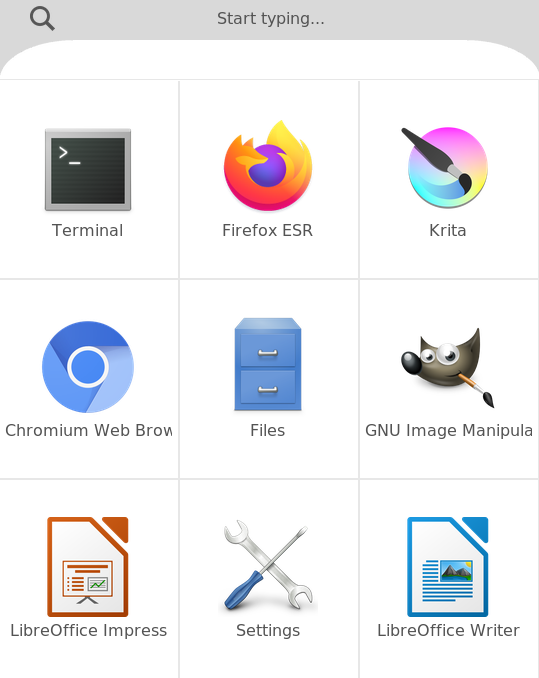
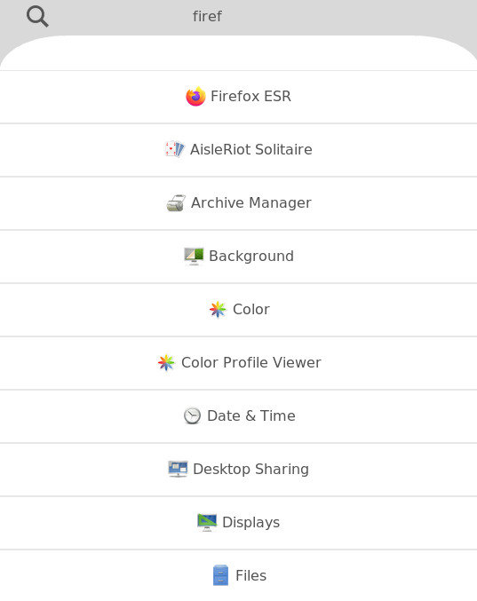
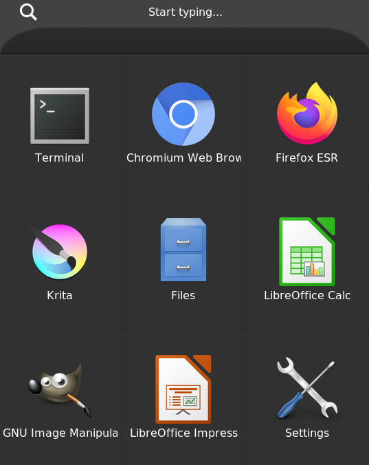

# * nero

### Simple app launcher with tiles



This launcher ships with fast and user-friendly UI, written in Tkinter

The major feature of this app launcher is its grid system, which allows you to select and run apps using keys, fingers or a TV remote.

Nero remembers the most popular apps and shows them (if none are specified).

Personally, I find the tiled view much more usable than traditional dropdown, like in Raspbian.
This project is mainly targeted at RPI users with TVs or mobile screens (VNC) as there are currently no launchers with similar features.

Note: Nero doesn't scan the desktop files each time, so you need to press Ctrl-R to update the app cache.

## Customization

Nero can be fully customized using its config system.
You may specify, for example, theme config, colors config, dimensions config, video config and apps config, variables will be overridden by the each next config.

Place `main.py` file under .config/nero-launcher directory and specify all the config files (without .py) in `MODULES=[]` variable.

Each config file must contain `CONFIG={...}` variable, please view variables.py for available configuration variables.

You shouldn't edit the variables.py file directly, because it is used as a default configuration file.

## Themes

To apply themes you will need to copy the theme file to `~/.config/nero-launcher` folder and add the theme name without the .py to `MODULES=[...]` variable in main.py

Example:

```
MODULES=["adwaita-dark", "custom-config"]
```

## Installation

Please run `pip3 install -r requirements.txt` to install some of the libraries.

On Debian-based systems run:

`sudo apt install python3-pil.imagetk python3-tk`

On Arch-based systems run:

`sudo pacman -S python-pillow tk`


Then run `sudo ./install.sh` to install Nero executable

## Speed

Please note that you will need to configure frame skip and dropdown animation speed, because of the Tkinter limitations:

In your config file specify

```
...
    'CanvasDropdownSpeed': ...,
    'CanvasDropdownFrameSkip': ...,
    'CanvasDropdownReturnSpeed': ...,
    'CanvasDropdownReturnFrameSkip': ...,
...
```

where CanvasDropdownSpeed/CanvasDropdownReturnSpeed should be between 5 and 15-20 and CanvasDropdownFrameSkip/CanvasDropdownFrameSkip should be between 10 and 50, according to your system.

## Screenshots





## Credits

Thanks @bahamas10 for the cec-keypresses script (https://gist.github.com/bahamas10/6996290)
